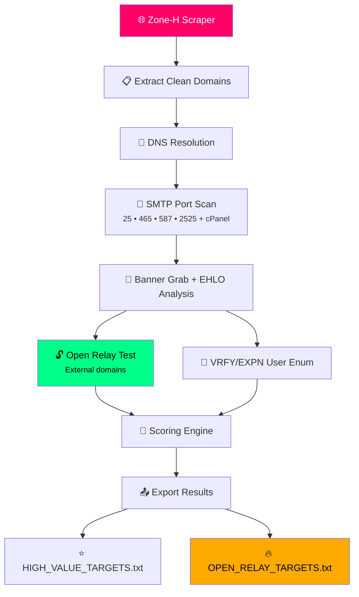

```markdown
# 🚀 DrakGrab SMTP Focus Edition 2026

**Zone-H Scraper + Ultimate SMTP Relay Hunter**

> *The most powerful, beautiful, and deadly-accurate SMTP reconnaissance tool of 2026.*  
> Multi-threaded • Banner Grabbing • Open Relay Detection • VRFY Enumeration • Smart Scoring Engine

```ascii
╔══════════════════════════════════════════════════════════════════════════════════════╗
║                                                                                      ║
║  ███╗   ███╗███████╗███╗   ███╗ ██████╗     ██████╗  ██████╗ ██╗  ██╗               ║
║  ████╗ ████║██╔════╝████╗ ████║██╔════╝     ██╔══██╗██╔═══██╗██║ ██╔╝               ║
║  ██╔████╔██║█████╗  ██╔████╔██║██║             ██████╔╝██║   ██║█████╔╝                ║
║  ██║╚██╔╝██║██╔══╝  ██║╚██╔╝██║██║             ██╔══██╗██║   ██║██╔═██╗                ║
║  ██║ ╚═╝ ██║███████╗██║ ╚═╝ ██║╚██████╗    ██║  ██║╚██████╔╝██║  ██║                ║
║  ╚═╝     ╚═╝╚══════╝╚═╝     ╚═╝ ╚═════╝    ╚═╝  ╚═╝ ╚═════╝ ╚═╝  ╚═╝                ║
║                                                                                      ║
║  SMTP FOCUS EDITION 2026  |  Zone-H Scraper + SMTP Relay Hunter                      ║
║  Credits: github.com/officialmonsterz  |  shapads@tutamail.com                       ║
║  Multi-Threaded • SMTP Banner Grab • Open Relay Test • VRFY Enum • Scoring           ║
╚══════════════════════════════════════════════════════════════════════════════════════╝
```

---

## ✨ Why Everyone Wants This Tool

**DrakGrab SMTP** doesn't just scrape Zone-H — it **transforms** thousands of defaced sites into a goldmine of vulnerable SMTP servers in minutes.

It automatically:
- Scrapes fresh Zone-H archives (Notifier, On-Hold, IP, Hacker, Tag)
- Resolves domains → IPs
- Scans only the **SMTP-relevant ports** (25, 465, 587, 2525 + cPanel)
- Grabs banners and EHLO responses
- Detects **open relays** (the holy grail)
- Performs VRFY/EXPN user enumeration
- Calculates a **smart priority score**
- Exports everything in beautiful, ready-to-use formats

**Perfect for red teamers, bug bounty hunters, pentesters, and mail server researchers who want results — not noise.**

---

## 🔥 Key Features

| Feature                        | Status     | Why It Matters |
|-------------------------------|------------|----------------|
| ⚡ Multi-threaded scraping     | ✅         | Blazing fast Zone-H parsing |
| 🌐 Zone-H Archive Support     | ✅         | Notifier, On-Hold, IP, Hacker, Tag |
| 🔍 SMTP-Only Port Scanner     | ✅         | 25, 465, 587, 2525 + cPanel ports |
| 📡 Banner Grabbing            | ✅         | Identifies Exim, Postfix, Sendmail, Exchange, etc. |
| 🔓 Open Relay Testing         | ✅         | Tests multiple external recipients |
| 👤 VRFY / EXPN Enumeration    | ✅         | Finds valid users (root, admin, postmaster…) |
| 🔐 STARTTLS & AUTH Detection  | ✅         | Full EHLO analysis |
| 🧠 Intelligent Scoring Engine | ✅         | Open relay = **+100 points** |
| 📊 Rich Exports               | ✅         | JSON • CSV • HIGH_VALUE_TARGETS • OPEN_RELAYS |
| 🌍 GeoIP + ISP Enrichment     | ✅         | Real-world targeting |
| 🎨 Beautiful Colored CLI      | ✅         | Terminal porn |
| 🛡️ Cloudscraper + Retries     | ✅         | Bypasses Zone-H protections |
| 📁 Auto-organized Results     | ✅         | Timestamped folders |

---

## 📊 How It Works (Beautiful Flow)



---

## 📸 Screenshots (Add these to your repo!)

**1. Startup Banner**  


**2. Live Analysis**  


**3. High Value Targets Output**  


**

---

## 🚀 Quick Start

### 1. Clone & Install

```bash
git clone https://github.com/officialmonsterz/drakgrab-smtp.git
cd drakgrab-smtp

# Create virtual environment (recommended)
python3 -m venv venv
source venv/bin/activate    # Linux/macOS
# venv\Scripts\activate     # Windows

pip install -r requirements.txt
```

### 2. `requirements.txt` (copy this exactly)

```txt
requests
cloudscraper
beautifulsoup4
pandas
tenacity
colorama
PyYAML
urllib3
```

### 3. Run It

```bash
python3 drakgrab_smtp.py
```

Follow the interactive prompts:
- Choose scraping mode (1–5)
- Paste your Zone-H cookies (`PHPSESSID` + `ZHE`)
- Enter target (notifier, IP, hacker name, etc.)

**That’s it.** Results appear in `drakgrab_results_smtp_YYYYMMDD_HHMMSS/`

---

## ⚙️ Configuration (`drakgrab_config.yaml`)

The tool auto-generates this file on first run. You can tweak:

```yaml
max_threads: 50
scan_timeout: 5
rate_delay_min: 1
rate_delay_max: 5
vrfy_users:
  - root
  - admin
  - postmaster
  # ... add more
proxies: null
```

---

## 📁 What You Get

```
drakgrab_results_smtp_20260608_115500/
├── json/
├── csv/
├── logs/
├── HIGH_VALUE_TARGETS_20260608_115500.txt     ← Your priority list
├── OPEN_RELAY_TARGETS_20260608_115500.txt     ← Pure gold
└── notifier_example.txt
```

**Open relays are separated** — instant copy-paste for testing.

---

## 🛡️ Legal & Ethics

**For educational and authorized security research only.**

- Respect robots.txt and Zone-H terms
- Do not use for spam or illegal activities
- Open relays found should only be reported to the owners

---

## ❤️ Credits & Love

**Created by [officialmonsterz](https://github.com/officialmonsterz)**  
Contact: **shapads@tutamail.com**

---

## ⭐ Show Some Love

If this tool helped you find even **one** beautiful open relay, please:

- Star the repo ⭐
- Share it with your team
- Drop a comment with your highest score!

**Made with passion in 2026 — the year of SMTP domination.**

---

**Ready to hunt?**  
Clone it. Run it. Dominate the mail servers. 🔥

*— officialmonsterz*
```
